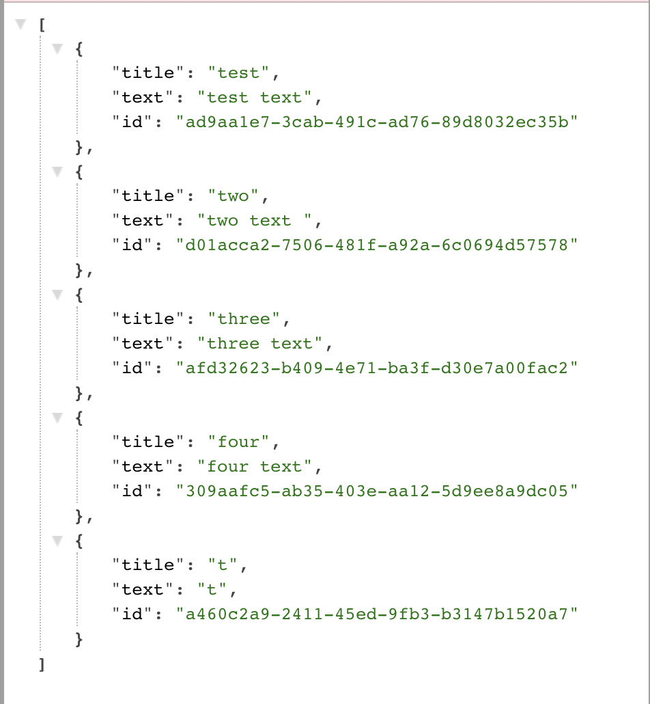

# Note-Taker

## Description

In this application, we modified starter code to create an application called Note Taker that can be used to write and save notes. This application uses Express.js backend and saves/retrieves note data from a JSON file.
The application is deployed Heroku.

## Table of Contents

- [Note-Taker](#note-taker)
  - [Description](#description)
  - [Table of Contents](#table-of-contents)
  - [Installation](#installation)
  - [Routes implemented](#routes-implemented)
  - [Demo](#demo)
  - [Features](#features)
  - [Built With](#built-with)
  - [Resources Used](#resources-used)
  - [Author](#author)
  - [License](#license)

## Installation

- Go to the app's [repo](https://github.com/imanmansour86/Note-Taker) in github and clone the app
- From terminal: navigate to app's directoty and run:

  ```md
  $ npm install
  ```

- To start the server from terminal, run:

  ```md
  $ npm run
  ```

## Routes implemented

GET /notes

Returns the notes.html file


GET \*

Returns the index.html file


GET /api/notes

Reads the db.jso file and return all saved notes as JSON



POST /api/notes

Receives a new note and add it to the db.json file, and then return the new note to the client


DELETE /api/notes/:id

Receives a query parameter that contains the id of a note to delete, then returns the notes list to the client with that note removed from db.json file


## Demo

- [Demo Link](https://watch.screencastify.com/v/C21Lj5uf2sOVbjNo0BmS)

## Features

When the user opens the application, a landing page appears with a link to a notes page. When click to go to notes page, a page is presented with a list of exisitng notes, plus empty fields to enter a new note's title and text. When new note details is added and save button is pressed, the new note is added to the list of notes. When click on exisitng note in the left-hand column, the note appears in the right-hand column. When click on delete icon for a certain note, then the note is removed from the notes list.

## Built With

- [Javascript](https://developer.mozilla.org/en-US/docs/Web/JavaScript)
- [Expressjs](https://expressjs.com/)
- [Nodejs](https://nodejs.dev/learn/output-to-the-command-line-using-nodejs)

## Resources Used

- [W3schools](https://www.w3schools.com)
- [stackoverflow](https://stackoverflow.com)
- [MDN](https://developer.mozilla.org/en-US/docs/Web/CSS)

## Author

Iman Mansour

- [Portfolio](https://imanmansour86.github.io/new-portfolio/)
- [Github](https://github.com/imanmansour86)
- [LinkedIn](https://www.linkedin.com/in/iman-mansour-51391515/)
- [Email](mailto:imanmansour86@gmail.com)

## License

This project is licensed under the MIT License
